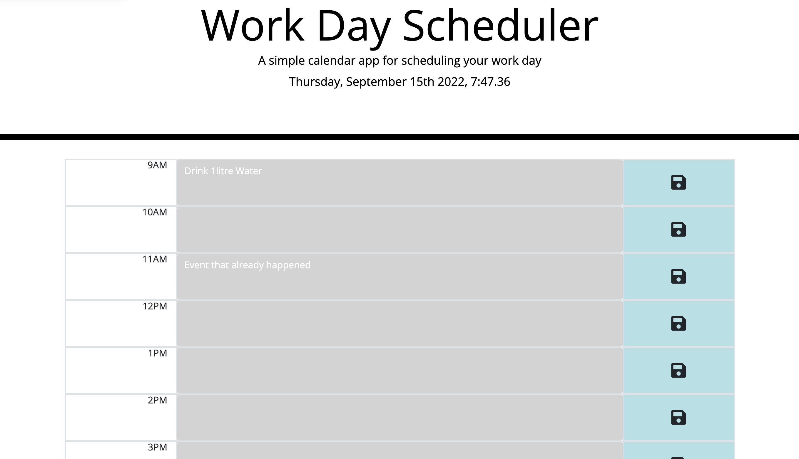
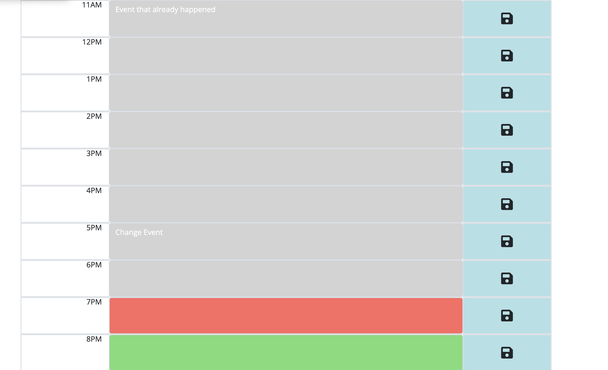

# WorkDayScheduler
<h2>DESCRIPTION:</h2>

Work Day Scheduler is designed to manage and plan day to day tasks. The user can write out their schedule for each hour and the app will help the user to keep track of time by coloring each hour with colors for past, present, and future.

# The Work Day Scheduler is designed with help of :
<li>HTML</li>
<li>CSS</li>
<li>JQuerry</li>
<li>Bootstrap</li>

# GitHub Repository link
<a href="https://github.com/vinitapp/WorkDayScheduler.git">Work Day Scheduler</a>

# Screenshots

